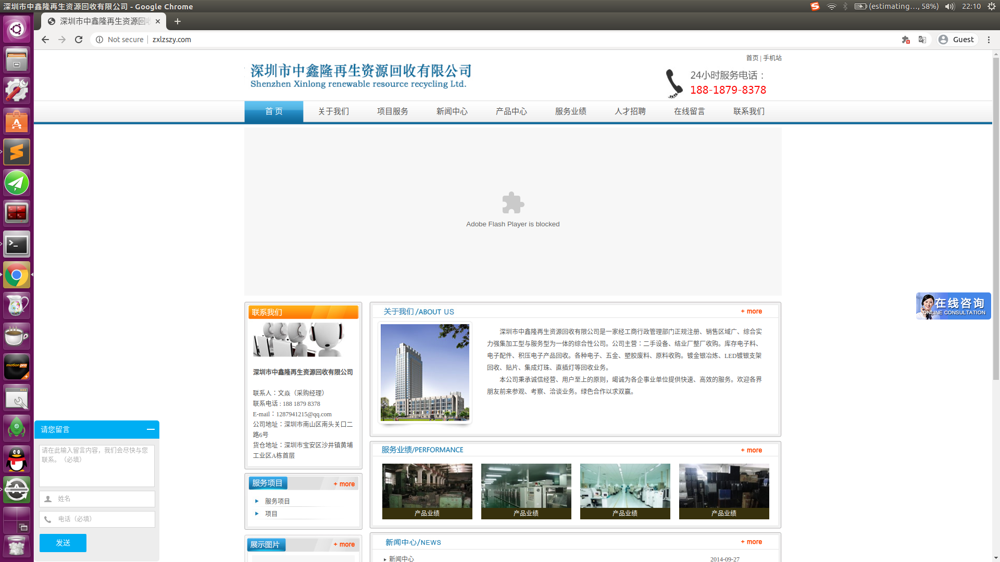

#Copy to https://github.com/aqiongbei/buy_pig_plan
# buy_pig_plan | 买猪计划
> #### 前言
> 我把项目的思路放在最后了,感兴趣的话直接拉到下面[看思路](https://github.com/aqiongbei/buy_pig_plan#思路分享).

#### 项目介绍

> 买猪计划：一个电话攻击、留言攻击的工具
> 为什么叫`买猪计划`呢？因为我最开始是通过猪场的网站发起电话攻击的，所以取名`买猪计划`。

这是一个用来对目标发起电话攻击的项目。坚持定时服用，这个项目会产生最漫长的、最有效的攻击。项目主要是通过两种方式产生两种不同效果的攻击。

##### 电话回拨系统（实时攻击）
这种方式利用网站常用的电话回拨系统发起攻击，目标一般会在攻击发出几分钟内收到电话。电话会由不同的号码打出（一般是网站的电话，所以收集的网站越多越好，目前支持1W+网站），所以即使目标拉黑几个也没有多大影响。对于这种攻击建议定时发起，比如深夜、凌晨。

##### 留言系统（非实时攻击）
这种方式利用网站的留言系统发起攻击，目标何时、收到何种方式的攻击取决于看到留言的人怎么处理。因为我们留下了手机号，所以看到留言后一般都是电话联系。这种方式很有意思，有点余音绕梁的感觉。这种攻击全天都可以发起，而且攻击越久持续效果越好。

两种方式都很有意思（跟短信轰炸比起来好多了），优点也很明显：

- **匿名**。除了**会带有IP信息**外，不会带有其他与你有关的信息
- **简单**。动动小手跑跑程序，比自己戳来戳去半天才发了几个骚扰短信简单多了
- **高效**。比起发短信攻击来说，直接电话攻击何止是高效啊，简直就是高效啊喂
- **零成本**。除了费点电费跑跑程序外你好像也没其他损失啊，我说零成本也不过分吧
- **数据多**。目前支持1.2W+网站电话回拨攻击、1.7W+网站留言攻击，而且还在不断更新
- **可重复**。对于电话回拨系统攻击的方式，可以经常跑一跑，即使是同一批网站多跑几次也是没有关系的
- **可放大**。不管是电话攻击还是留言攻击，都存在对方做电话回访的可能性，所以，你发动的可不仅仅是一次攻击哦

#### 使用教程

- 下载
```sh
git clone https://github.com/aqiongbei/bomer.git
```

- 安装依赖

```sh
# 由于安装puppeteer时候需要下载chromium，而下载chromium需要外网，所以建议对puppeteer使用国内镜像下载，加上下面这句
npm config set puppeteer_download_host=https://npm.taobao.org/mirrors
npm install
```

- 配置
**使用前请先修改配置文件**，配置文件共有两个，都放在`/config`目录下。
    - `default.json`: 默认配置文件，所有可配置的内容都在这里列举了，`npm start`使用的就是这个配置文件
    - `debug.json`: debug模式的配置文件，在debug模式这里的配置会覆盖`default.json`中的配置

各个配置字段说明说明如下：
```js
{
    "target": {                     // 攻击目标的配置
        "phone": "",                // 目标的手机号 必填
        "name": "",                 // 目标的姓名 必填
        "email": "",                // 目标的邮箱 尽量填写，有的网站需要
        "address": "",              // 目标的地址 尽量填写，有的网站需要
        "comment": "",              // 留言攻击时候留言的内容，留言模式必须
    },
    "attack": {                     // 攻击任务的配置
        "times": 6,                 // 攻击次数
        "time": "0 2 * * * *",      // 定时模式下的攻击时间配置
        "web_type": "baidu_lxb",    // 攻击的网站类型，支持的类型都在`/flow/flow.js`中定义
        "type_type": "call",        // 攻击的类型，目前支持"comment" "call"两种
        "interval": 600000,         // 攻击的间隔，间隔太小会提示操作频繁，起不到攻击作用，默认60s
    },
    "chromium": {                   // chromium的配置信息
        "slowMo": 100,              // 向网页输入信息的每个字符的间隔
        "timeout": 30000,           // 网页请求超时时间，超过这个时间没有请求完成，这个任务就算失败
        "devtools": false,          // 是否开启chromium的 devtools，默认false就好
    }
}
```

- 启动项目
```sh
# production模式，非立即执行，是定时执行的
npm start
# debug模式
npm run debug
```

- 网站源切换
#### 实现功能

- 电话攻击
- 留言攻击
- 定时任务
- 任务报告
- 任务统计
- 随机网站攻击
- 100000+网站支持
- 攻击参数可配置

#### 思路分享
整个项目的思路是这样的:
##### step 0 网站收集
从[百度离线宝(百度的一个营销平台,内含电话回拨系统,简单说就是可以通过网站打电话)](https://lxb.baidu.com/lxb/index.html)的一个不知道[为何存在的页面](http://lxbjs.baidu.com/cb/url/show?f=56&id=1)遍历id获取使用其服务的客户网站.然后打开他们客服的网站,根据下面的特征我们可以大致分成三种:
- 有电话回拨功能的(下图右边中部),这中网站我称之为`call`类型

- 有留言功能的(下图左下角),这种网站我称之为`comment`类型

- 没有以上两种任意一种功能的

前两种是我需要的网站类型,我会把他们保存在`json`文件中,供后面的流程使用.
这个步骤对应的脚本是`/utils/get_lxb_sources.js`,使用方法是
更改`/utils/get_lxb_sources.js`里面的
```js
// start_id end_id
await start(114000, 114001); // 更改这里的传参,第一个参数为开始id,第二个为结束id,这里建议start_id和end_id相差10000最好
```
然后在项目根目录跑一下这个脚本
```sh
node /utils/get_lxb_sources.js
```
脚本跑完之后会在`sources`目录的不同类型下产生形如:`baidu_shangqiao_50000.json`的文件.

接下来我们开始使用这些收集到的网站.

##### step 1 开始攻击
step 0我们已经收集到了一些可用的网站,现在我们要使用这些网站了.
在主程序运行的时候,针对不同类型的网站我会采用不同的处理逻辑,但是大致的流程都一样,就拿`call`类型的网站:
- 在chromium中打开这个页面
- 等页面加载加载完成之后在页面内`.lxb-cb-input`对应的输入框中输入目标的手机号,然后点击`.lxb-cb-input-btn`元素触发电话回拨
- 1s中之后收集上个操作是否成功的反馈,方便后面统计使用

对于`comment`的网站,操作类似:
- 在chromium中打开这个页面
- 等页面加载加载完成之后在页面内找到一些必填的信息,把目标的信息填写进去,然后提交
- 1s中之后收集上个操作是否成功的反馈,方便后面统计使用

这样就实现了一次攻击.明白了思路之后再来看文件结构就很简单了
```sh
.
├── app.js
├── config
│   ├── debug.json
│   └── default.json
├── flow
│   ├── call
│   │   ├── baidu_lxb.js
│   │   └── baidu_shangqiao.js
│   ├── comment
│   │   └── baidu_shangqiao.js
│   └── flow.js
├── LICENSE
├── package.json
├── package-lock.json
├── README.md
├── sources
│   ├── call
│   │   └── baidu_lxb.json
│   ├── comment
│   │   └── baidu_shangqiao.json
│   └── sms
└── utils
    ├── get_lxb_sources.js
    └── util.js
```
- `app.js`是入口文件
- `config`下面放的是攻击的配置信息,三个文件,两个环境,一个`debug`环境一个`production`环境
- `flow`下面放的是具体攻击的流程信息,目前支持两种攻击类型`call`&`comment`,在设计上其实还预留了`sms`这样的攻击方式,只是没有发现合适的网站去实现
- `sources`下面按照不同的攻击类型(或者叫网站类型,这两个概念在现在的设计中是统一的)放了一些收集到的可用网站
- `utils`一些工具方法
